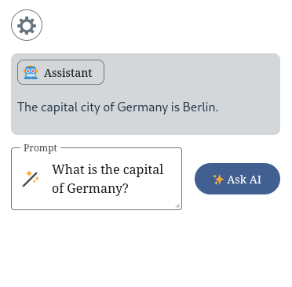
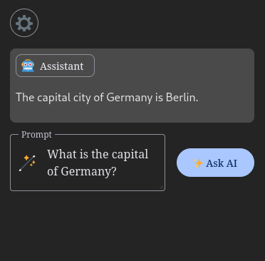
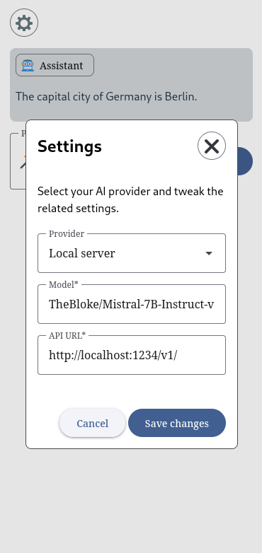
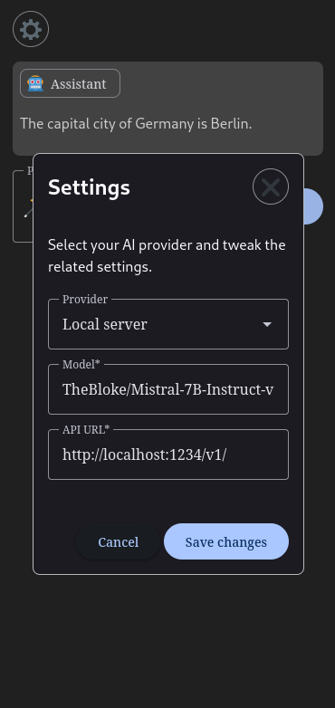

# ✨ AI chat widget

>  ⚠️ **Warning** This is a learning project. It's not meant to be used in production environments.

🚧 **Work in progress** 🚧 This is a native [web component](https://developer.mozilla.org/en-US/docs/Web/API/Web_components) which provides **basic** AI chat functionality (single question, no history).

| | |
|-|-|
|  | 
|  |  |

[See more](./public/preview/)

### 📋 Features
* [ ] Integrate it in your website - Use it in your vanilla website or with a framework which [supports](https://custom-elements-everywhere.com/) web components
* [x] Provider selection - You could use [Open AI API](https://platform.openai.com/) or another local LLM server like [LM Studio](https://lmstudio.ai/) or [LocalAI](https://localai.io/)
* [x] Theming - Could be customized and adapted to light/dark user preferences
* [x] Stream responses - The response is shown to you at same time it is generated
* [x] Syntax highlight for code snippets

### 🔒 Privacy

* 🟢 **Database** - The project is using [IndexDB](https://developer.mozilla.org/en-US/docs/Web/API/IndexedDB_API), under the hood. This is native, local database which modern browsers provide. Meaning any configuration you provide is stored locally on your machine,accessible only to you.
* **AI prompts** - Every question you ask has to be processed somewhere which leaves it to the AI provider to dictate the privacy level.
  * 🟢 Local provider - Everything is stored locally
  * 🟡 Open AI - Any prompts are send to Open AI's API for processing

### 🚀 Get started

1. **Add the module to your website**

##### With bundler
```sh
$ npm i @rumenpetrov/ai-chat-widget
```

```js
// index.js
import '@rumenpetrov/ai-chat-widget'
```

##### Use CDN for buldless approach

```html
<script type="module" src="https://esm.sh/@rumenpetrov/ai-chat-widget/dist/bundle.js"></script>
```

2. **Get yourself a theme** - You could use [Material Theme Builder on the Web](https://material-foundation.github.io/material-theme-builder/) to generate all the CSS custom properties (design tokens) which the UI library we are using expects to function correctly and add them to you styles.

```html
<!-- Quick light/dark theme example -->
<!doctype html>
<html lang="en">
  <head>
    ...
    <style>
      :root {
        color-scheme: light dark;

        font-family: system-ui, sans-serif;
        color: #213547;
        background-color: #ffffff;

        /* All generated tokens from the light theme you got form Material Theme Builder */
        --md-sys-color-primary: rgb(65 95 145);
        --md-sys-color-surface-tint: rgb(65 95 145);
        ...
      }

      @media (prefers-color-scheme: dark) {
        :root {
          color: rgba(255, 255, 255, 0.87);
          background-color: #242424;

          /* All generated tokens from the dark theme you got form Material Theme Builder */
          --md-sys-color-primary: rgb(170 199 255);
          --md-sys-color-surface-tint: rgb(170 199 255);
          ...
        }
      }
    }
    </style>
    ...
  </head>
  <body>
    ...
  </body>
</html>
```

3. **Use the web component somewhere on your page**

```html
<acw-root></acw-root>
```

4. **Make sure you select and configure your AI provider of choice** - You could use the settings modal for this.

### 🖌️ Styling

* The UI is based on [Material web](https://material-web.dev/) components which means you could use [CSS custom properties](https://material-web.dev/theming/material-theming/) to overwrite any of the tokens their components expose.
* There are [part](https://developer.mozilla.org/en-US/docs/Web/CSS/::part) attributes spread around the UI which could be used for styling as well

### Technical stack
* [Vite](https://vitejs.dev/)
* [Lit](https://lit.dev/)
* [Material web](https://material-web.dev/)
* [IndexDB wrapper](https://github.com/jakearchibald/idb)
* [Marked](https://marked.js.org/)
* [highlight.js](https://highlightjs.org/)